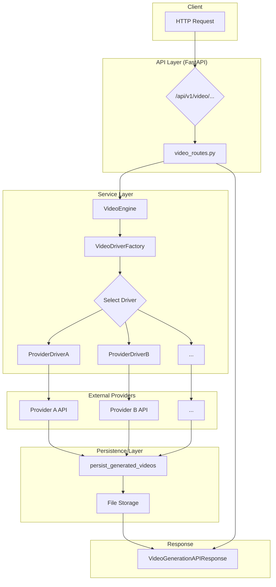

# Video Generation Service

This document provides a developer-focused overview of the video generation module, covering its architecture, core components, and instructions for extending it.

## 1. Architecture

The video generation service is designed with a provider-agnostic architecture, allowing it to connect with various external video generation APIs (e.g., Google Gemini, Replicate) through a unified interface.

The core workflow is as follows:

1.  **API Endpoint**: An incoming request is received by one of the FastAPI endpoints (`/generate` or `/generate-multipart`).
2.  **VideoEngine**: The endpoint delegates the request to the `VideoEngine`, which is the central orchestrator.
3.  **Driver Factory**: The `VideoEngine` uses the `VideoDriverFactory` to select the appropriate driver based on the `provider` specified in the request.
4.  **Provider Driver**: The selected driver translates the standardized `VideoGenerationRequest` into the specific format required by the external provider's API and executes the request.
5.  **Persistence**: The response from the provider (containing video data, often as a URL or base64 string) is processed by the `persist_generated_videos` function. This function downloads the video, stores it in the local file storage, and generates a public-facing URL.
6.  **API Response**: The final, standardized `VideoGenerationAPIResponse` is returned to the client, containing URLs to the stored videos and other metadata.



## 2. Core Components

### `video_routes.py`
-   **Location**: `app/api/v1/endpoints/video_routes.py`
-   **Responsibility**: Defines the public-facing API for video generation.
-   **Endpoints**:
    -   `POST /generate`: Accepts a JSON payload (`VideoGenerationAPIRequest`). Ideal for programmatic access where inputs (like images) can be base64-encoded.
    -   `POST /generate-multipart`: Accepts `multipart/form-data`. This is necessary for web clients that upload files directly from a user's device.

### `VideoEngine`
-   **Location**: `app/services/ai/video/base.py`
-   **Responsibility**: The main entry point for the video generation logic. It is provider-agnostic.
-   **Functionality**:
    -   Takes a `VideoGenerationRequest` object.
    -   Determines which provider to use (request-specific or a system default).
    -   Uses the `VideoDriverFactory` to instantiate the correct driver.
    -   Invokes the driver's `generate` method.
    -   Normalizes the driver's output into a standard `VideoGenerationResult` object.

### `VideoDriverFactory`
-   **Location**: `app/services/ai/video/factory.py`
-   **Responsibility**: Manages the registration and retrieval of all available video drivers.
-   **Functionality**:
    -   Drivers are automatically registered at startup via side-effect imports.
    -   The `get(provider_name)` method returns an initialized driver instance, injecting its configuration from `config/video_models.yaml`.

### `BaseVideoDriver`
-   **Location**: `app/services/ai/video/drivers/base_driver.py`
-   **Responsibility**: Defines the abstract interface that all provider-specific drivers must implement.
-   **Key Methods**:
    -   `generate(request: VideoGenerationRequest)`: The core method where the logic for interacting with the external provider's API resides.

### `persistence.py`
-   **Location**: `app/services/ai/video/persistence.py`
-   **Responsibility**: Handles the storage of generated videos.
-   **Functionality**:
    -   The `persist_generated_videos` function takes a list of `GeneratedVideo` objects.
    -   For each video, it fetches the video data (either from a URL or a base64 string).
    -   It saves the video bytes to the configured storage engine (see `app/core/storage_engine.py`).
    -   It returns a list of `VideoGenVideo` schema objects containing the public URL and filesystem path of the stored videos.

### Schemas (`ai_video.py`)
-   **Location**: `app/schemas/ai_video.py`
-   **Responsibility**: Defines the data contracts for the API.
-   **Models**:
    -   `VideoGenerationAPIRequest`: The input model for the `/generate` endpoint.
    -   `VideoGenerationAPIResponse`: The output model for both generation endpoints.
    -   `VideoGenVideo`: A structured representation of a single generated video asset.

## 3. Configuration

### Environment Variables
-   **`VIDEO_DEFAULT_PROVIDER`**: (Optional) Sets the default provider to use if none is specified in the request (e.g., `replicate`).
-   **`VIDEO_DEFAULT_MODEL`**: (Optional) Sets the default model for the chosen provider.

### Model Catalog (`video_models.yaml`)
-   **Location**: `config/video_models.yaml`
-   **Responsibility**: A central catalog of all supported video providers and their models.
-   **Structure**:
    -   The root `providers` key contains a dictionary of provider configurations.
    -   Each provider (e.g., `gemini`, `replicate`) has a `name`, a `default_model`, and a dictionary of `models`.
    -   Each model entry contains detailed information about its capabilities, limits, supported parameters, and pricing. This configuration is injected into the driver at runtime.

## 4. How to Add a New Provider

Adding a new video generation provider involves four steps:

1.  **Create a New Driver**:
    -   Create a new file in `app/services/ai/video/drivers/`, for example, `my_provider_driver.py`.
    -   Inside, define a class that inherits from `BaseVideoDriver`.
    -   Set the `provider` class attribute to a unique key (e.g., `my-provider`).
    -   Implement the `generate` method. This method should contain the logic to call the new provider's API and return a `VideoGenerationResult`.

    ```python
    # app/services/ai/video/drivers/my_provider_driver.py
    from .base_driver import BaseVideoDriver
    from ..types import VideoGenerationRequest, VideoGenerationResult

    class MyProviderDriver(BaseVideoDriver):
        provider = "my-provider"

        def generate(self, request: VideoGenerationRequest) -> VideoGenerationResult:
            # 1. Get API keys from self.config or settings
            # 2. Transform `request` into the provider's format
            # 3. Make the API call using httpx or a dedicated SDK
            # 4. Normalize the response into a VideoGenerationResult
            #    and return it.
            pass
    ```

2.  **Register the Driver**:
    -   In `app/services/ai/video/drivers/__init__.py`, import your new driver class. This will automatically register it with the factory due to the side-effect of the import.

    ```python
    # app/services/ai/video/drivers/__init__.py
    from .my_provider_driver import MyProviderDriver

    __all__ = ["MyProviderDriver"]
    ```

3.  **Update the Model Catalog**:
    -   Add the new provider and its models to `config/video_models.yaml`.

    ```yaml
    # config/video_models.yaml
    providers:
      # ... existing providers
      my-provider:
        name: "My Provider"
        default_model: "model-a"
        models:
          model-a:
            description: "My Provider's Model A"
            # ... other model details
    ```

4.  **Add API Keys**:
    -   Add the necessary API keys or credentials to the environment (`.env`) and load them in `app/core/config.py`. The driver can access them from its `self.config` dictionary or by importing `settings`.

## 5. API Usage Examples

### JSON Request (`/generate`)

```bash
curl -X POST "http://127.0.0.1:8000/api/v1/video/generate" \
-H "Content-Type: application/json" \
-d '{
  "prompt": "a cinematic shot of a panda drinking a smoothie",
  "provider": "replicate",
  "model": "runwayml/gen2",
  "duration_seconds": 4,
  "aspect_ratio": "16:9"
}'
```

### Multipart Request (`/generate-multipart`)

This example assumes you have an image file named `seed_image.png` in the current directory.

```bash
curl -X POST "http://127.0.0.1:8000/api/v1/video/generate-multipart" \
-H "Content-Type: multipart/form-data" \
-F "prompt=a robot dancing based on this image" \
-F "provider=replicate" \
-F "model=runwayml/gen2" \
-F "image_files=@seed_image.png"
```
